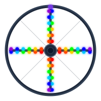

# Burning Man LED Wheel

<p align="center">
  
</p>

<p align="center">
  Super cool Burning Man wheel LEDs inspired by <a href="https://www.youtube.com/watch?v=W3Gmv9J05eQ">Monkey Lights POV</a>
</p>

---

## Overview

POV (Persistence of Vision) LED display for a 26" bike wheel. Animated images appear to float in the spinning wheel, visible from both sides. Controlled via WiFi from your phone — no app needed.

⚠️ **Use the front wheel.** The rear wheel has a hub motor — spoke geometry is different, heavier, and mounting is messier.

## Hardware

| Component | Notes |
|-----------|-------|
| 2x XIAO ESP32-S3 | Main controller — WiFi + MicroPython |
| SK9822 LED strip | 144 LEDs/m, black PCB, IP30 — 72 LEDs total (36 per arm)<br> 30 LEDs/m black PCB, IP30 — 14 LEDs total (7 per arm)  |
| 2x LiPo 3.7V 2000mAh | Self-contained per wheel, removable nightly for charging |
| 2x TP4056 USB-C | LiPo charger with protection circuit |
| 2x MT3608 boost converter | 3.7V → 5V for LEDs and XIAO |
| 2x A3144 hall effect sensor | Rotation sync — one trigger per revolution |
| 2x 6mm neodymium magnet | Mounts on fork, triggers hall sensor |
| 2x 1/2 in. x 10 in - 1/8 in. Thick Aluminum Flat Bar | Bar to mount LED |
| 2x ABS enclosure 80×50×26mm | Hub-mounted, houses all electronics |
| 2x SPST rocker switch | Kill switch — mounted on enclosure wall |

## Two-arm design

**Front Wheel**
Using 144 LED/Meter.  One arms mounted with LED strips on both faces on the aluminium bar — one facing left, one facing right. LEDS 1- 36 we will have the image, and then from 37-72, we will have the same image.   Will the second image need to be inverted since 37-72 start from the rim and finsh at the hub

**Back Wheel**
Using 30 LED/Meter. Using One arms mounted with LED strips on both faces on the aluminium bar — one facing left, one facing right. LEDS 1- 7 we will have the image, and then from 8-14, we will have the same image.   Will the second image need to be inverted since 37-72 start from the rim and finsh at the hub

```
        ARM 1
    ● ● ● ●      ← LEDs face right
    ═══════
    ● ● ● ●      ← LEDs face left
        │
       HUB  (XIAO + battery)
```

## Burning Man notes

- **Balance** — mount battery as close to hub center as possible
- **Don't tap the e-bike battery** — keep LED system on its own LiPo, modular and safe
- **Nightly charging** — LiPo velcro-mounts to enclosure floor, unplugs via JST connector in seconds
- **Playa-proof** — apply MG Chemicals 419D conformal coat to all boards after testing

## Built with

- MicroPython
- VS Code + MicroPico extension
- Blood, sweat, and tears
- claude.ai for tips and explanations
- [StackEdit](https://stackedit.io/) for this README

## Files
- **main.py** - Main loop — WiFi server + POV timing. Auto-runs on boot
```
Boot → Start WiFi + Web Server
         ↓
Loop → Check web requests every 100ms
         ↓
      Wheel spinning? No → LEDs off
         ↓ Yes
      Get rotation period from hall sensor
         ↓
      Display 60 columns timed to rotation speed
         ↓
      Repeat forever
```
- **apa102.py** - SPI driver for SK9822/APA102 LED strip
```
XIAO GPIO9 (MOSI) ──→ DI ──→ LED 1 ──→ LED 2 ──→ ... ──→ LED 72
XIAO GPIO7 (SCK)  ──→ CI ──→ LED 1 ──→ LED 2 ──→ ... ──→ LED 72

Each LED receives 4 bytes, keeps its own color data, and passes the remaining bytes down the chain to the next LED. The end frame bytes clock through to make sure the last LED in the chain latches its data correctly.

Every strip.show() call sends this exact sequence:
[00 00 00 00]           ← Start frame (4 zero bytes) — "attention LEDs!"
[FF rr gg bb]           ← LED 1 color (4 bytes)
[FF rr gg bb]           ← LED 2 color (4 bytes)
...
[FF rr gg bb]           ← LED 72 color (4 bytes)
[FF FF FF FF FF]        ← End frame — "that's all!"
```

- **hall_sync.py** - SPI driver for SK9822/APA102 LED strip
```
Magnet passes sensor
        ↓
Pin goes HIGH → LOW (falling edge)
        ↓
Hardware interrupt fires instantly
        ↓
_on_trigger() records timestamp + period + count
        ↓
main.py reads period_us → calculates column timing
main.py reads rotation_count → advances animation frame
main.py calls is_spinning() → decides whether to show LEDs
```

| File | Purpose |
|------|---------|

| `` |  |
| `hall_sync.py` | Hall sensor interrupt handler — measures rotation period |
| `frames.py` | Frame data — pixel columns for each animation frame |
| `convertImage.py` | Laptop-side script — converts PNG to `frames.py` format |
| `BOM.txt` | Full bill of materials with sources and prices |

## WiFi control

The XIAO acts as its own WiFi access point — no internet or router needed.

1. Connect phone to **BikeWheel** network (password: `burningman`)
2. Open browser → `192.168.4.1`
3. Control on/off, brightness, speed, upload new images

## Animation frames

Planned animation sequence:
1. 🌈 **Nyan Cat** — pixel art, full color
2. ⚫ **Angine de Poitrine polka dot mask** — high contrast, black + white
3. 😎 **Joe's face** — high contrast portrait

## Image conversion pipeline

Design artwork at **60 × 78 pixels** in any image editor → run `convertImage.py` on laptop → upload `frames.py` to XIAO via VS Code → image appears on wheel.

## License

MIT
